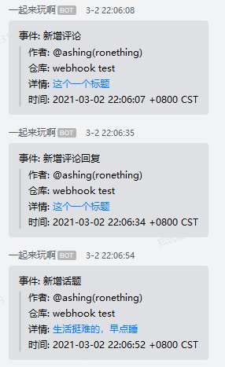

<!-- START doctoc generated TOC please keep comment here to allow auto update -->
<!-- DON'T EDIT THIS SECTION, INSTEAD RE-RUN doctoc TO UPDATE -->
**Table of Contents**  *generated with [DocToc](https://github.com/thlorenz/doctoc)*

- [yuque-webhook-wecom](#yuque-webhook-wecom)
  - [前言](#%E5%89%8D%E8%A8%80)
  - [配置](#%E9%85%8D%E7%BD%AE)
  - [效果](#%E6%95%88%E6%9E%9C)
  - [致谢](#%E8%87%B4%E8%B0%A2)

<!-- END doctoc generated TOC please keep comment here to allow auto update -->

## yuque-webhook-wecom

### 前言

~~语雀 webhook 默认只支持 dingtalk，为了支持企业微信机器人，于是只能自己编写代码进行相应解析并推送.~~

其实是支持的，只是语雀文档貌似没有找到而已，配置了是可以正常发送的，不过是卡片形式，不过要自定义格式之类的，就可以通过此程序进行自定义.

### 配置

- [sample.yaml](./config/sample.yaml)

### 效果

### 致谢

- [go.mod](go.mod)
